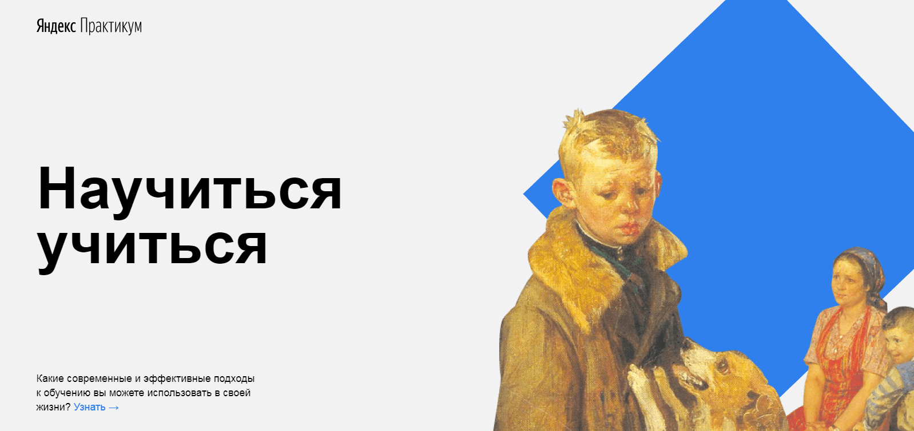

# Типовой одностраничный сайт **"Научится учиться"**

## Описание

Учебный проект [Яндекс практикум](https://practicum.yandex.ru/) по курсу "Расширенные возможности HTML и CSS".

## Используемые технологии

* HTML CSS
* флексбокс-вёрстка
* позиционирование
* анимации и трансформации
* фреймы
* Структура кода по [методолотгии БЭМ](https://ru.bem.info/methodology/)
* [Оптимизация картинок](https://tinypng.com/)

## GitHub Pages
https://voitekhovich.github.io/how-to-learn/
